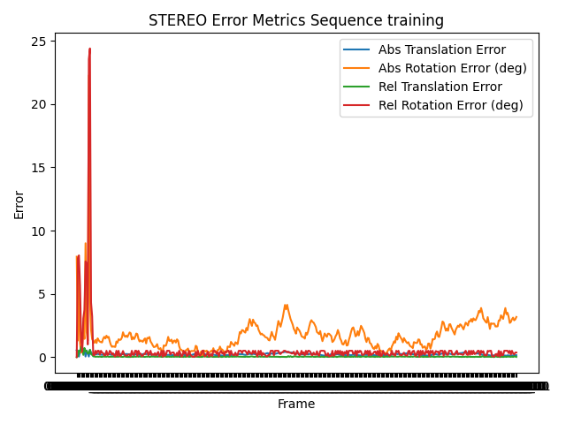
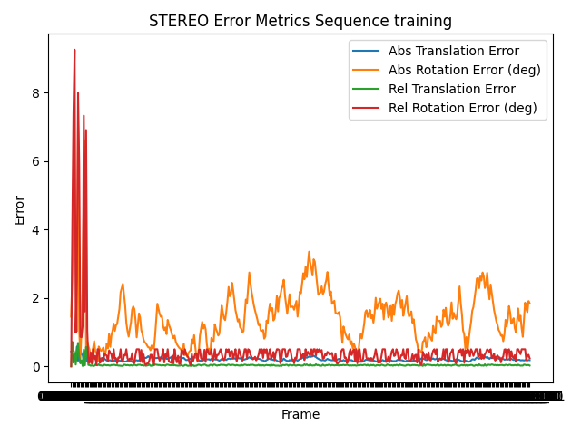
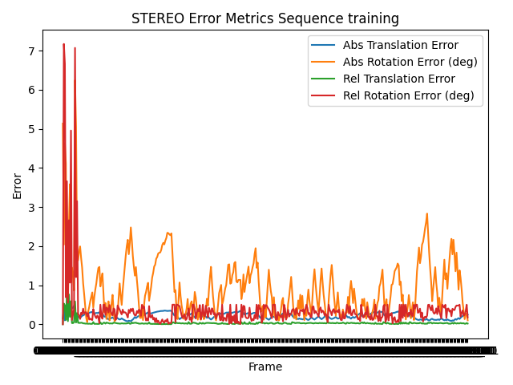

# Online Stereo Camera Extrinsic Calibration

A lightweight real-time pipeline for certifiable, online extrinsic calibration of a fixed stereo camera rig. This repo implements the method from "Online Extrinsic Parameters Calibration of On-Board Stereo Cameras Based on Certifiable Optimization," with additional practical enhancements for faster convergence and low-jitter output.

---

## Repository Layout

```plaintext
.
├── configs/                # Default YAML configurations
├── data_cb/                # Checkerboard calibration datasets
├── data_stereo/            # KITTI stereo training & testing
├── data_vo/                # VO sequences & ground truth
├── scripts/                # Run scripts & utilities
├── src/                    # Core modules (features, matching, pose, filtering)
├── outputs/                # Sample outputs & result figures
└── README.md
```

---

## Installation

```bash
git clone https://github.com/merichoglu/online_calib.git
cd online_calib
python3 -m venv venv
source venv/bin/activate
pip install -r requirements.txt
```

---

## Quick Start

Run on the KITTI stereo training sequence:

```bash
python -m scripts.run_online   --dataset stereo   --config configs/default.yaml   --delay 0.05
```

The filtered extrinsic estimates and evaluation CSV will be written under `outputs/online/stereo_results/`.

---

## Sample Outputs

### Stereo Feature Matches


#### Error Metrics Over Time

**ORB:**



**SIFT:**



**SuperPoint + SuperGlue:**



---

## Quantitative Results (KITTI Stereo Training)

### ORB

| Metric                  | Mean ± Std    |
| ----------------------- | ------------- |
| Abs. Translation Error  | 0.216 ± 0.077 |
| Abs. Rotation Error (°) | 1.75 ± 1.45   |
| Rel. Translation Error  | 0.046 ± 0.087 |
| Rel. Rotation Error (°) | 0.55 ± 1.87   |

### SIFT

| Metric                  | Mean ± Std    |
| ----------------------- | ------------- |
| Abs. Translation Error  | 0.205 ± 0.050 |
| Abs. Rotation Error (°) | 1.44 ± 0.81   |
| Rel. Translation Error  | 0.044 ± 0.071 |
| Rel. Rotation Error (°) | 0.45 ± 0.92   |

### SuperPoint + SuperGlue

| Metric                  | Mean ± Std    |
| ----------------------- | ------------- |
| Abs. Translation Error  | 0.215 ± 0.077 |
| Abs. Rotation Error (°) | 0.94 ± 0.78   |
| Rel. Translation Error  | 0.034 ± 0.075 |
| Rel. Rotation Error (°) | 0.36 ± 0.69   |

### Overall Comparison Table

| Method                   | Abs Trans Err (↓) | Abs Rot Err (deg ↓) | Rel Trans Err (↓) | Rel Rot Err (deg ↓) |
| ------------------------ | ----------------- | ------------------- | ----------------- | ------------------- |
| **ORB**                  | 0.216 ± 0.077     | 1.75 ± 1.45         | 0.046 ± 0.087     | 0.55 ± 1.87         |
| **SIFT**                 | **0.205 ± 0.050** | 1.44 ± 0.81         | 0.044 ± 0.071     | 0.45 ± 0.92         |
| **SuperPoint+SuperGlue** | 0.215 ± 0.077     | **0.94 ± 0.78**     | **0.034 ± 0.075** | **0.36 ± 0.69**     |

---

## Recommended Metric for Real-time Calibration Task

* **Relative error** (translation & rotation) is the primary metric, reflecting the calibration algorithm's short-term stability and smoothness—crucial for real-time online performance.
* **Absolute error** (translation & rotation) complements this by assessing long-term accuracy and potential drift.

---

## Configuration Highlights

* **Features:** ORB, SIFT, or SuperPoint
* **Matching:** Brute-force/FLANN for classical, SuperGlue for learned descriptors
* **Pose Estimation:** RANSAC (0.5 px) + GNC (20 iters) + cheirality check
* **Filtering:** 15-frame warm-up, complementary filter with adaptive α (squared–ratio), α0 = 0.10

See `configs/default.yaml` for full options.
