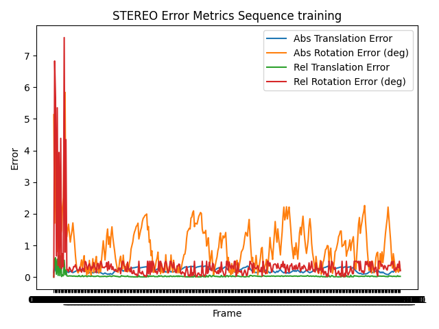

#TODO: TRY LEARNED FEATURE METHODS LIKE SUPERPOINT

# Online Stereo Camera Extrinsic Calibration

A lightweight real-time pipeline for certifiable, online extrinsic calibration of a fixed stereo camera rig. This repo implements the method from "Online Extrinsic Parameters Calibration of On-Board Stereo Cameras Based on Certifiable Optimization," with additional practical enhancements for faster convergence and low-jitter output.

---

## Repository Layout

```
.
├── configs/                # Default YAML configurations
├── data_cb/                # Checkerboard calibration datasets
├── data_stereo/            # KITTI stereo training & testing
├── data_vo/                # VO sequences & ground truth
├── scripts/                # Run scripts & utilities
├── src/                    # Core modules (features, matching, pose, filtering)
├── outputs/                # Sample outputs & result figures
└── README.md
```

---

## Installation

```bash
git clone https://github.com/merichoglu/online_calib.git
cd online_calib
python3 -m venv venv
source venv/bin/activate
pip install -r requirements.txt
```

---

## Quick Start

Run on the KITTI stereo training sequence:

```bash
python -m scripts.run_online   --dataset stereo   --config configs/default.yaml   --delay 0.05
```

The filtered extrinsic estimates and evaluation CSV will be written under `outputs/online/stereo_results/`.

---

## Sample Outputs

#### Stereo Feature Matches


#### Error Metrics Over Time



---

## Quantitative Results

| Metric                         | Value                          |
| ------------------------------ | ------------------------------ |
| **Abs. Translation Error (m)** | **0.192 ± 0.050 (0.107–0.391)** |
| **Abs. Rotation Error (°)**    | **1.75 ± 0.80 (0.45–3.78)**     |
| **Rel. Translation Error (m)** | 0.027 ± 0.011 (0.008–0.050)     |
| **Rel. Rotation Error (°)**    | **0.262 ± 0.142 (0.010–0.400)** |

*Numbers computed over frames 16–end on the KITTI training split. See CSV under `outputs/online/stereo_results/tables/` for detailed results.*

---

## Configuration Highlights

* **Features:** ORB with 2000 keypoints
* **Matching:** ratio test = 0.75, grid-based spatial cull
* **Pose Estimation:** RANSAC (0.5 px) + GNC (20 iters) + cheirality check
* **Filtering:** 15-frame warm-up, complementary filter with adaptive α (squared–ratio), α₀ = 0.10

See `configs/default.yaml` for full options.
